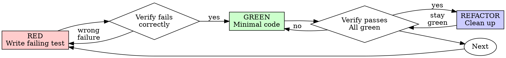

# Test-Driven Development (TDD)

## Overview

Write the test first. Watch it fail. Write minimal code to pass.

**Core principle:** Watching a test fail for the expected reason gives evidence that it detects the behavior you intend to change.

## When to Use

TDD is an option, not a prerequisite for every change. It is particularly useful for new behavioral contracts, reproducible bugs, and refactors where regression protection matters.

For questions, simple edits, configuration, generated code, or experiments, work directly and choose proportionate verification. No permission or other skill invocation is needed to choose a different method.

## Choosing the Test-First Cycle

When choosing TDD, write a focused failing test, implement enough to pass it, then refactor while keeping it green. The RED observation distinguishes this technique from writing tests after implementation.

If implementation already exists, keep useful code. Add behavior or characterization tests and, when safe, use an isolated pre-fix revision or a controlled mutation to check that the test detects the defect. Do not delete code merely because it was not written test-first, and do not describe tests-after as a test-first run.

## Red-Green-Refactor



### RED - Write Failing Test

Write one minimal test showing what should happen.

<Good>
```typescript
test('retries failed operations 3 times', async () => {
  let attempts = 0;
  const operation = () => {
    attempts++;
    if (attempts < 3) throw new Error('fail');
    return 'success';
  };

  const result = await retryOperation(operation);

  expect(result).toBe('success');
  expect(attempts).toBe(3);
});
```
Clear name, tests real behavior, one thing
</Good>

<Bad>
```typescript
test('retry works', async () => {
  const mock = jest.fn()
    .mockRejectedValueOnce(new Error())
    .mockRejectedValueOnce(new Error())
    .mockResolvedValueOnce('success');
  await retryOperation(mock);
  expect(mock).toHaveBeenCalledTimes(3);
});
```
Vague name, tests mock not code
</Bad>

**Requirements:**
- One behavior
- Clear name
- Real code (no mocks unless unavoidable)

### Verify RED - Watch It Fail

The failing run is an essential part of the chosen TDD cycle.

```bash
npm test path/to/test.test.ts
```

Confirm:
- Test fails (not errors)
- Failure message is expected
- Fails because feature missing (not typos)

**Test passes?** It may cover existing behavior. For a new regression test, check whether it actually detects the missing behavior; don't change valid expectations just to manufacture a failure.

**Test errors?** Fix error, re-run until it fails correctly.

### GREEN - Minimal Code

Write simplest code to pass the test.

<Good>
```typescript
async function retryOperation<T>(fn: () => Promise<T>): Promise<T> {
  for (let i = 0; i < 3; i++) {
    try {
      return await fn();
    } catch (e) {
      if (i === 2) throw e;
    }
  }
  throw new Error('unreachable');
}
```
Just enough to pass
</Good>

<Bad>
```typescript
async function retryOperation<T>(
  fn: () => Promise<T>,
  options?: {
    maxRetries?: number;
    backoff?: 'linear' | 'exponential';
    onRetry?: (attempt: number) => void;
  }
): Promise<T> {
  // YAGNI
}
```
Over-engineered
</Bad>

Don't add features, refactor other code, or "improve" beyond the test.

### Verify GREEN - Watch It Pass

Run the focused test again after implementation.

```bash
npm test path/to/test.test.ts
```

Confirm:
- Test passes
- Relevant existing tests still pass
- New errors or warnings are understood and addressed; unrelated baseline noise is reported accurately

**Test fails?** Investigate whether the code or expectation is wrong; don't weaken a valid assertion to make it green.

**Other tests fail?** Determine whether the change caused them. Fix regressions and report unrelated failures.

### REFACTOR - Clean Up

After green only:
- Remove duplication
- Improve names
- Extract helpers

Keep tests green. Don't add behavior.

### Repeat

Next failing test for next feature.

## Good Tests

| Quality | Good | Bad |
|---------|------|-----|
| **Minimal** | One thing. "and" in name? Split it. | `test('validates email and domain and whitespace')` |
| **Clear** | Name describes behavior | `test('test1')` |
| **Shows intent** | Demonstrates desired API | Obscures what code should do |

For additional test-design techniques, optionally consult [writing-good-tests.md](writing-good-tests.md):
- Name the production change that would make the test fail — before writing it
- Assert on real behavior, never on mock behavior
- Keep test-only code in test utilities, out of production classes
- Understand a dependency's side effects before mocking it

## Tradeoffs and Common Mistakes

| Situation | Useful response |
|-----------|-----------------|
| Test passes immediately | Check whether it would catch the intended regression; it may be a valid characterization test |
| Implementation preceded tests | Keep useful code, add meaningful coverage, and describe the evidence honestly |
| Manual verification fits the task | Exercise the actual behavior and record what was checked; automate likely recurring regressions |
| Test is hard to write | Consider whether the interface or dependency boundaries can be simpler |
| Existing code has no tests | Start at the behavior being changed rather than testing every untouched function |
| Prototype or exploratory work | Learn what is needed, then choose verification appropriate to anything retained |
| Cannot explain the failing result | Resolve setup errors or incorrect expectations before treating it as RED evidence |

## Example: Bug Fix

**Bug:** Empty email accepted

**RED**
```typescript
test('rejects empty email', async () => {
  const result = await submitForm({ email: '' });
  expect(result.error).toBe('Email required');
});
```

**Verify RED**
```bash
$ npm test
FAIL: expected 'Email required', got undefined
```

**GREEN**
```typescript
function submitForm(data: FormData) {
  if (!data.email?.trim()) {
    return { error: 'Email required' };
  }
  // ...
}
```

**Verify GREEN**
```bash
$ npm test
PASS
```

**REFACTOR**
Extract validation for multiple fields if needed.

## Optional TDD Self-Check

For behavior developed with this cycle:

- Did the new test fail for the intended reason before the fix?
- Does it exercise the real contract rather than echo a mock?
- Does the implementation pass the focused test?
- Were relevant regressions, edge cases, and errors checked?
- Does the reported evidence distinguish observed results from checks not run?

This is a diagnostic aid, not a requirement to create a task list or restart useful work.

## When Stuck

| Problem | Solution |
|---------|----------|
| Don't know how to test | Write wished-for API. Write assertion first. Ask your human partner. |
| Test too complicated | Design too complicated. Simplify interface. |
| Must mock everything | Code too coupled. Use dependency injection. |
| Test setup huge | Extract helpers. Still complex? Simplify design. |

## Debugging Integration

A failing reproduction often makes a strong regression test. TDD can guide the fix once the cause is understood; a manual reproduction or one-off smoke check may be more appropriate when automation is impractical.

No other skill is required. The important outcome is a justified fix and honest evidence about what was exercised.
